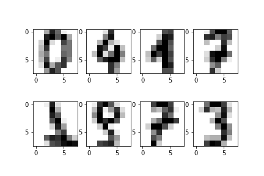
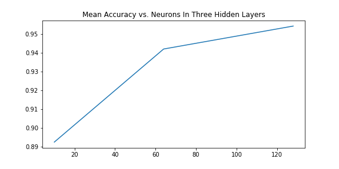

# Image Classification

The purpose of this project is to explore different models in order to classify different handwritten numbers. 

Each row of the dataset represents a number that has been handwritten. There are 64 columns. We can reshape the row to make an 8 by 8 picture of the number. Here a few examples:

The models used are:
- K Nearest Neighbors
- Neural Network (with 1, 2, and 3 hidden layers and varying layer sizes)

The graph below shows how increasing the number of neurons in every layer affects performance.
